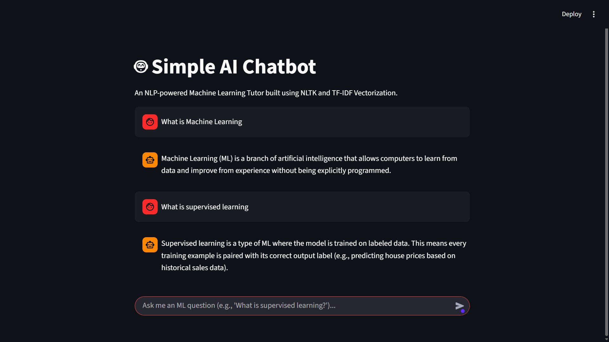

# 🤖 Simple AI Chatbot: Machine Learning Tutor
   ```markdown
   

## 📖 Project Description
This is a foundational, rule-based Natural Language Processing (NLP) chatbot designed to act as an interactive Machine Learning tutor. The application takes raw human language queries, processes them using professional text normalization techniques, and mathematically maps them to pre-defined educational intent categories. It features a strict boundary validation threshold to handle out-of-domain conversational queries and is deployed inside a responsive, browser-based graphical web interface.

## ✨ Features
* **Text Preprocessing:** Utilizes NLTK's advanced tokenization to split strings into individual words and strips out punctuation noise.
* **Text Normalization:** Implements NLTK's `WordNetLemmatizer` to reduce words to their base dictionary root forms (e.g., converting "learning" or "learned" down to "learn"), ensuring high-accuracy keyword matching.
* **Statistical Vectorization:** Uses scikit-learn's `TfidfVectorizer` to calculate the mathematical term frequency and inverse document frequency weights across the dataset.
* **Intent Classification:** Computes the angular distance between vectors using cosine similarity to find the closest match index.
* **Boundary Filtering Guardrails:** Implements a strict mathematical validation filter threshold (0.22). Queries falling below this score are automatically flagged as out-of-domain and safely routed to a controlled fallback message handler.
* **Interactive Web Interface:** Built on top of the Streamlit framework with session state management to preserve chat histories during active execution.

## 🛠️ Tech Stack
* **Python 3**
* **NLTK (Natural Language Toolkit)** for tokenization and word lemmatization
* **Scikit-Learn** for TF-IDF matrix generation and Cosine Similarity equations
* **Streamlit** for the frontend chat interface UI
* **JSON** for the underlying intent knowledge base data structure

---

## 📦 Installation & Setup

1. **Clone the repository** to your local machine:
   ```bash
   git clone https://github.com/YOUR-USERNAME/YOUR-REPO-NAME.git
   ```
2. **Navigate** into the project directory:
   ```bash
   cd YOUR-REPO-NAME
   ```
3. **Install the dependencies** required to run the application:
   ```bash
   pip install nltk scikit-learn streamlit
   ```

## 🚀 Usage

To start up your chatbot, open your terminal in the project directory and run:
```bash
streamlit run app.py
```

This will automatically launch a tab in your default web browser containing the chatbot UI. You can test it with Machine Learning questions such as:
* *"What is supervised learning?"*
* *"Can you explain overfitting?"*
* *"What is the difference between classification and regression?"*